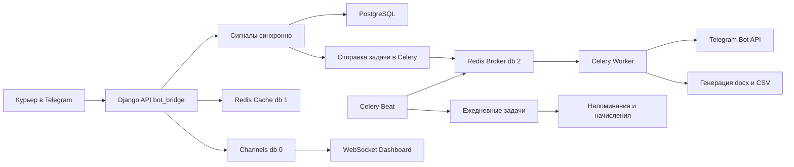

# Celery и Redis в WERP — распределение задач

> **Статус:** ✅ РЕАЛИЗОВАНО (2026-08-31). Celery + Celery Beat внедрены, задачи перенесены.
> **Цель:** Подготовка к деплою: вынести тяжёлые и периодические операции из HTTP-запроса в фоновые задачи, не ломая синхронную цепочку сигналов (деньги и склад).
>
> **Что сделано:**
> - `WERP_system/celery.py` — инстанс Celery, брокер `redis://.../2`, явная регистрация задач
> - `apps/bot_bridge/tasks.py` — 7 задач уведомлений (клиент, курьер, админ, отчёты рейсов/смен)
> - `apps/accounting/tasks.py` — 3 периодические задачи (рассрочки, сброс балансов, зарплаты)
> - `apps/dashboard/tasks.py` — пересчёт Finance за вчера
> - `apps/warehouse/tasks.py` + `apps/warehouse/utils.py` — генерация путевого листа .docx
> - `apps/bot_bridge/views.py` — синхронные вызовы `notify_*` заменены на `.delay()`
> - Beat-расписание в `settings.py` (CELERY_BEAT_SCHEDULE)
> - Проверено: worker запускается, 99/100 тестов проходят

---

## 1. Ключевая идея

**Redis и Celery — не конкуренты, а партнёры.**

- **Redis** — это хранилище: кэш + pub/sub (каналы WebSockets). Он уже используется в проекте.
- **Celery** — это менеджер фоновых задач, который **использует Redis как брокер** (очередь сообщений).

Схема:

```
Django (HTTP-запрос)
    │
    ├─► Синхронно: сигналы (деньги, склад) → PostgreSQL
    │
    └─► Асинхронно: .delay() → Redis (очередь) → Celery Worker → Telegram / docx / CSV
```

---

## 2. Что уже использует Redis (НЕ трогаем)

| Назначение | Бэкенд | База Redis | Файл |
|---|---|---|---|
| Кэш Django | `django_redis.cache.RedisCache` | `redis://.../1` | [`WERP_system/settings.py`](../../WERP_system/settings.py) |
| Каналы WebSockets | `channels_redis.core.RedisChannelLayer` | `redis://.../0` | [`WERP_system/settings.py`](../../WERP_system/settings.py) |

Для Celery-брокера выделяем **отдельную базу Redis `2`**, чтобы не смешивать очереди с кэшем и каналами.

---

## 3. Задачи для Celery

### 3.1 Фоновые задачи (по событию, `.delay()`)

Сейчас выполняются **синхронно в HTTP-запросе** и тормозят ответ курьеру/клиенту:

| # | Задача | Где сейчас | Почему на Celery |
|---|---|---|---|
| 1 | Отправка Telegram-уведомлений: `notify_client_order_delivered`, `notify_client_order_accepted`, `notify_courier_new_order`, `notify_admin_alert` | [`apps/bot_bridge/views.py`](../../apps/bot_bridge/views.py) | HTTP-запрос к Telegram API до 10 сек (timeout в [`notify.py`](../../apps/bot_bridge/notify.py)). Курьер ждёт ответ API, пока сообщение уходит |
| 2 | Отчёты о закрытии рейса/смены: `notify_trip_closed`, `notify_shift_closed` | [`apps/bot_bridge/views.py`](../../apps/bot_bridge/views.py) | Тяжёлый расчёт (`get_trip_summary()` + агрегация `OrderItem` + отправка всем OWNER) блокирует ответ курьеру |
| 3 | Генерация путевого листа `.docx` | [`apps/warehouse/views.py`](../../apps/warehouse/views.py) — заглушка | CPU-задача: чтение данных + генерация docx |
| 4 | Экспорт отчётов CSV/XLSX | [`apps/dashboard/services/export_placeholder.py`](../../apps/dashboard/services/export_placeholder.py) | Тяжёлые выборки за период → файл → ссылка на скачивание |
| 5 | Массовая рассылка (например, всем курьерам о новом заказе в пуле) | — | Цикл по N получателям не должен блокировать создание заказа |

### 3.2 Периодические задачи (Celery Beat)

Сейчас это management-команды, запускаемые вручную или по cron:

| # | Задача | Команда сейчас | Расписание |
|---|---|---|---|
| 1 | Напоминания о рассрочках | [`send_installment_reminders.py`](../../apps/accounting/management/commands/send_installment_reminders.py) | Ежедневно 09:00 Asia/Samarkand |
| 2 | Начисление зарплат | [`accrue_salaries.py`](../../apps/accounting/management/commands/accrue_salaries.py) | 1-го числа каждого месяца |
| 3 | Сброс баланса зарплаты (`reset_balance_if_expired`) | [`apps/accounting/utils.py`](../../apps/accounting/utils.py) | Ежедневно |
| 4 | Агрегация `Finance` за вчера (страховка от пропущенных сигналов) | — | Ежедневно ночью |
| 5 | Проверка критических остатков склада → алерт владельцу | — | Ежедневно утром |

### 3.3 Что НЕ выносить на Celery (критично!)

⚠️ **Сигналы, создающие финансовые транзакции и складские движения, остаются синхронными:**

- `create_transaction_on_order` (accounting)
- `update_stock_on_order` (warehouse)
- `update_shift_totals_on_order` (logistics)
- `update_finance_record` (accounting)

**Почему:** Эти сигналы — источник правды для денег и склада. Если Celery-воркер упадёт или очередь переполнится — заказ доставлен, а транзакция не создана. Деньги «потеряются». Сигналы выполняются в рамках транзакции БД. А вот **уведомления** об этих событиях (Telegram-сообщения) — можно и нужно выносить в Celery.

---

## 4. Что остаётся на Redis (без Celery)

| Назначение | Описание |
|---|---|
| Кэш (`db 1`) | Кэширование тяжёлых выборок Dashboard, списков заказов |
| Channels layer (`db 0`) | WebSocket-группы для живого мониторинга финансов |
| Rate limiting (опционально) | Ограничение частоты запросов к API бота |
| FSM-состояния aiogram (опционально) | Если бот переведём на RedisStorage вместо памяти |

---

## 5. Архитектура после внедрения



---

## 6. План внедрения (файлы)

| Файл | Действие |
|---|---|
| `requirements.txt` | Добавить `celery>=5.4`, `django-celery-beat` |
| `WERP_system/celery.py` | Создать — инстанс Celery, `autodiscover_tasks` |
| `WERP_system/__init__.py` | Добавить `from .celery import app as celery_app` |
| `WERP_system/settings.py` | `CELERY_BROKER_URL=redis://.../2`, `CELERY_RESULT_BACKEND`, `CELERY_BEAT_SCHEDULE` |
| `apps/bot_bridge/tasks.py` | Создать — `send_telegram_message_task`, `notify_trip_closed_task`, `notify_shift_closed_task` |
| `apps/warehouse/tasks.py` | Создать — `generate_waybill_task` |
| `apps/dashboard/tasks.py` | Создать — `export_report_task`, `recalc_finance_for_date` |
| `apps/accounting/tasks.py` | Создать — `send_installment_reminders_task`, `accrue_salaries_task`, `reset_expired_salaries_task` |
| `docker-compose.yml` | Добавить сервисы `celery-worker` и `celery-beat` (тот же образ, что Django) |
| `apps/bot_bridge/views.py` | Заменить прямые вызовы `notify_*` на `.delay()` |

---

## 7. Ключевые решения

1. **Брокер:** использовать тот же Redis (новая БД `2` для очереди) — не нужен отдельный RabbitMQ. Для масштаба проекта (1 компания, ~10 курьеров) Redis-брокера достаточно.
2. **Результаты задач:** `CELERY_RESULT_BACKEND` можно отключить (`rpc://` или `disabled`) — для уведомлений результат не нужен, это сэкономит память Redis.
3. **Синхронные сигналы остаются** — только уведомления уходят в фон.

---

## 8. Docker Compose (целевое состояние)

```yaml
services:
  db:        # PostgreSQL 17 (уже есть)
  redis:     # Redis 7 (уже есть)

  web:       # Django + Gunicorn/Uvicorn (добавить)
    build: .
    command: gunicorn WERP_system.wsgi:application --bind 0.0.0.0:8000
    depends_on: [db, redis]

  celery-worker:
    build: .
    command: celery -A WERP_system worker --loglevel=info
    depends_on: [db, redis]

  celery-beat:
    build: .
    command: celery -A WERP_system beat --loglevel=info
    depends_on: [db, redis]
```

---

## 9. Порядок реализации

1. Добавить зависимости в `requirements.txt`.
2. Создать `WERP_system/celery.py` и подключить в `__init__.py`.
3. Настроить `settings.py` (брокер, beat-расписание).
4. Создать `tasks.py` в `bot_bridge`, `warehouse`, `dashboard`, `accounting`.
5. Заменить синхронные вызовы `notify_*` на `.delay()` в `views.py`.
6. Обновить `docker-compose.yml` (worker + beat).
7. Тесты: убедиться, что сигналы не сломаны, уведомления уходят в очередь.