# Концепция: Контейнерные операции (Container Operations)

**Создано:** 2026-05-26  
**Статус:** Актуально — реализовано в этапе 3.7 и последующих обновлениях  
**Связанные модули:** `apps/logistics`, `apps/warehouse`, `apps/accounting`, `apps/bot_bridge`

## Зачем это нужно в нашем проекте

В бизнесе доставки воды 20л существует сложная логика учета тары (баклажек). Клиенты могут:
1. **Обменять** пустую баклажку на полную (возврат тары)
2. **Купить воду вместе с тарой** (новая баклажка)
3. **Вернуть бракованную тару** (без обмена)

Каждая операция имеет разные финансовые и складские последствия. Раньше это учитывалось через поле `container_op` в модели `Order`, но такой подход не позволял:
- Учитывать несколько типов операций в одном заказе
- Работать с многопозиционными заказами
- Точно отслеживать списание со склада

Новая архитектура с полями `exchange_qty`, `sell_with_qty`, `defective_qty` в модели `OrderItem` решает эти проблемы.

## Как это работает (с нуля)

### Аналогия из реальной жизни

Представьте, что вы — курьер, который везет воду клиентам. У вас в машине:
- **Вода 19л** (продукт `WATER`) — это сама вода без тары
- **Тара 19л** (продукт `BOTTLE`) — пустые баклажки, которые вы забираете у клиентов или выдаете им

Когда вы приезжаете к клиенту, возможны три сценария:

1. **Обмен (EXCHANGE)** — клиент дает вам 1 пустую баклажку, вы даете ему 1 полную бутыль воды. Результат:
   - Клиент получает воду (продукт `WATER`)
   - Вы получаете пустую тару (возвращаете на склад)
   - Со склада списывается 1 баклажка (выдана клиенту ранее)

2. **Продажа с тарой (SELL_WITH)** — клиент покупает воду вместе с новой баклажкой. Результат:
   - Клиент получает воду (продукт `WATER`)
   - Клиент получает новую тару (продукт `BOTTLE`) как отдельную позицию в заказе
   - Со склада списывается 1 баклажка (выдана клиенту)

3. **Брак (DEFECTIVE)** — клиент возвращает бракованную баклажку. Результат:
   - Вы забираете бракованную тару
   - Со склада ничего не списывается (брак не считается расходом)
   - Тару нужно утилизировать или вернуть поставщику

### Техническая реализация

#### Модель OrderItem
```python
class OrderItem(models.Model):
    order = models.ForeignKey(Order, related_name='items', on_delete=models.CASCADE)
    product = models.ForeignKey('products.Product', on_delete=models.PROTECT)
    quantity = models.IntegerField(default=1)  # Общее количество воды
    price = models.IntegerField(null=True, blank=True)  # Цена позиции
    
    # Контейнерные операции
    exchange_qty = models.IntegerField(default=0)  # Обмен тары
    sell_with_qty = models.IntegerField(default=0)  # Продажа с тарой
    defective_qty = models.IntegerField(default=0)  # Брак тары
```

#### Бизнес-правила
1. **Валидация:** `exchange_qty + sell_with_qty + defective_qty ≤ quantity`
   - Нельзя вернуть/продать больше тары, чем доставлено воды
   
2. **Значения по умолчанию:** При создании заказа `exchange_qty = quantity`, `sell_with_qty = 0`, `defective_qty = 0`
   - Предполагается, что весь заказ является обменом (клиент приносит пустые бутылки)
   - Курьер может изменить эти значения при подтверждении доставки
   
3. **Ограничение продажи с тарой:** `sell_with_qty ≤ exchange_qty`
   - Продажа с тарой не может превышать количество обменов (клиент должен сначала обменять пустую тару, чтобы купить с новой тарой)

4. **Автоматическое создание позиций:** При подтверждении заказа с `sell_with_qty > 0` автоматически создается отдельная позиция с продуктом `BOTTLE` (тара) с количеством равным `sell_with_qty`.

5. **Списание со склада:** При подтверждении заказа (`status = DELIVERED`) списывается:
   - Для продукта `WATER`: списывается `quantity` воды
   - Для продукта `BOTTLE`: списывается `quantity` тары (это количество проданной с водой тары)
   - `exchange_qty` и `defective_qty` не списываются со склада (только логируются)

6. **Финансовый учет:** Создается транзакция на сумму `price` каждой позиции. Для позиции `BOTTLE` цена обычно равна 0, так как стоимость тары уже включена в стоимость воды.

#### Сигналы (автоматическая обработка)

```mermaid
graph TD
    A[Order подтвержден] --> B[Сигнал: update_stock_on_order]
    B --> C{Тип продукта?}
    C -->|WATER| D[Списать quantity воды]
    C -->|BOTTLE| E[Списать quantity тары]
    C -->|Другие| F[Списать quantity]
    D --> G[Записать в StockMovement]
    E --> G
    F --> G
    A --> H[OrderConfirmationView]
    H --> I{sell_with_qty > 0?}
    I -->|Да| J[Создать позицию BOTTLE]
    I -->|Нет| K[Пропустить]
    A --> L[Сигнал: create_transaction_on_order]
    L --> M[Создать FinancialTransaction]
```



## Ловушки и частые ошибки

### 1. Рекурсивные сигналы
При сохранении `OrderItem` срабатывает сигнал `recalculate_order_price`, который может вызвать цепочку других сигналов. Решение: использовать `update_fields` и избегать лишних `save()`.

### 2. Race conditions при списании со склада
Если два курьера одновременно подтверждают заказы с одинаковым продуктом, может возникнуть ситуация "последний запись побеждает". Решение: использовать `select_for_update()` или оптимистичные блокировки.

### 3. Неправильная валидация данных
Клиентский интерфейс (Telegram бот) должен валидировать данные перед отправкой:
- Проверять, что сумма операций с тарой не превышает количество
- Проверять, что `defective_qty` не требует списания тары

### 4. Миграция исторических данных
Старые заказы с полем `container_op` нужно конвертировать в новую структуру. Решение: написать миграцию данных, которая создаст `OrderItem` записи на основе старых данных.

## Изменения в API (2026-05-26)

С 26 мая 2026 года формат API для подтверждения заказов был изменён:

### Старый формат (устарел)
```json
{
  "order_id": 123,
  "confirmed": true,
  "container_op": "EXCHANGE",
  "note": ""
}
```

### Новый формат (актуальный)
```json
{
  "order_id": 123,
  "confirmed": true,
  "items": [
    {
      "item_id": 456,
      "exchange_qty": 3,
      "sell_with_qty": 2,
      "defective_qty": 0
    }
  ],
  "note": ""
}
```

**Причины изменений:**
- Поддержка многопозиционных заказов (несколько продуктов в одном заказе)
- Возможность указывать разные операции с тарой для каждой позиции
- Более точный учёт списания со склада

**Соответствующие изменения во фронтенде:**
- Файл `frontend/courier/src/api.js` — функция `confirmOrder` теперь принимает массив `items` вместо `container_op`
- Файл `frontend/courier/src/pages/OrderConfirm.jsx` — сбор данных из состояния `itemStates` и отправка в новом формате

## В нашем коде

### Ключевые файлы
1. **`apps/logistics/models.py`** — модель `OrderItem` с полями контейнерных операций
2. **`apps/logistics/signals.py`** — сигнал `recalculate_order_price` для пересчета стоимости
3. **`apps/warehouse/signals.py`** — сигнал `update_stock_on_order` для списания тары
4. **`apps/bot_bridge/serializers.py`** — сериализаторы `OrderConfirmationSerializer` и `OrderQuantityUpdateSerializer`
5. **`apps/bot_bridge/views.py`** — вьюхи для обработки API запросов

### Пример использования
```python
# Создание заказа с контейнерными операциями
order = Order.objects.create(client=client, trip=trip, payment_type=Order.PaymentType.CASH)

# Позиция 1: 3 бутыли воды, из них 1 обмен, 1 с тарой, 0 брак
item1 = OrderItem.objects.create(
    order=order,
    product=water,  # продукт WATER
    quantity=3,
    exchange_qty=1,
    sell_with_qty=1,
    defective_qty=0
)

# При подтверждении заказа через OrderConfirmationView:
# 1. Обновляются поля контейнерных операций в item1
# 2. Автоматически создается позиция BOTTLE с quantity=1 (sell_with_qty)
# 3. Заказ переводится в статус DELIVERED

# После подтверждения заказ будет содержать:
# - Позиция 1: WATER, quantity=3, exchange_qty=1, sell_with_qty=1, defective_qty=0
# - Позиция 2: BOTTLE, quantity=1, price=0 (автоматически создана)

# Списание со склада:
# - WATER: списывается 3 единицы воды
# - BOTTLE: списывается 1 единица тары
# - exchange_qty=1 не списывается (это возврат тары от клиента)
# - defective_qty=0 не списывается

# Финансовый учет:
# - Создается транзакция для WATER на сумму 3 * price_water
# - Создается транзакция для BOTTLE на сумму 0 (тара уже учтена в стоимости воды)
```

## Последние изменения (2026-05-26)

### Исправление проблемы с exchange_qty=0
**Проблема:** При создании заказов через админку или API для WATER продуктов поле `exchange_qty` оставалось равным 0, хотя должно было устанавливаться в значение `quantity`.

**Решение:**
1. **В модели `OrderItem` добавлена логика в метод `save()`:**
   ```python
   def save(self, *args, **kwargs):
       """Автоматический расчет цены позиции при сохранении"""
       # Установка exchange_qty по умолчанию для продуктов WATER
       if self.pk is None and self.exchange_qty == 0:
           # Проверяем, является ли продукт WATER (тип '19W')
           if self.product.type_product == '19W':
               self.exchange_qty = self.quantity
       
       if self.price is None:
           self.price = self.product.price * self.quantity
       super().save(*args, **kwargs)
   ```

2. **В сериализаторе `OrderCreateModelSerializer` добавлена валидация:**
   ```python
   def validate_items(self, items):
       for item in items:
           # Установка значений по умолчанию для WATER продуктов
           if 'exchange_qty' not in item:
               product = Product.objects.get(id=item['product'])
               if product.type_product == '19W':
                   item['exchange_qty'] = item['quantity']
                   item['sell_with_qty'] = 0
                   item['defective_qty'] = 0
   ```

3. **Выполнена миграция существующих данных:** Все WATER позиции с `exchange_qty=0` были обновлены.

### Обновление фронтенда для корректного отображения
**Изменения в `frontend/courier/src/pages/OrderConfirm.jsx`:**
1. **Функция `isBottle20L` обновлена** для проверки типа продукта '19W':
   ```javascript
   const isBottle20L = (item) => {
     const name = (item.product_name || '').toLowerCase()
     const type = item.product_type || ''
     // Проверяем, является ли продукт WATER (тип '19W') или содержит "вода" в названии
     return type === '19W' || name.includes('вода') || name.includes('water')
   }
   ```

2. **Сериализатор `OrderItemSerializer` расширен** для включения поля `product_type`:
   ```python
   class OrderItemSerializer(serializers.ModelSerializer):
       product_name = serializers.CharField(source='product.name', read_only=True)
       product_type = serializers.CharField(source='product.type_product', read_only=True)
   ```

### Бизнес-правила (валидация)
1. **`sell_with_qty ≤ exchange_qty`** — продажа с тарой не может превышать количество обменов
2. **`exchange_qty + sell_with_qty + defective_qty ≤ quantity`** — сумма операций не может превышать общее количество
3. **Поля container_op отображаются только для WATER продуктов** — для других продуктов (аксессуары, кулеры) показывается только поле количества

### Результаты тестирования
- ✓ Все WATER позиции теперь имеют корректный `exchange_qty`
- ✓ Фронтенд правильно определяет WATER продукты по типу '19W'
- ✓ Валидация бизнес-правил работает корректно
- ✓ Автоматическое создание BOTTLE позиций при `sell_with_qty > 0` функционирует

## Связанные концепции
- [[docs/Concepts/Concepts_DjangoSignals|Сигналы Django]] — механизм автоматической обработки событий
- [[docs/Modules/Modules_Warehouse|Модуль Склада]] — учет остатков и движений товаров
- [[docs/Modules/Modules_Logistics|Модуль Логистики]] — полное описание архитектуры заказов и рейсов