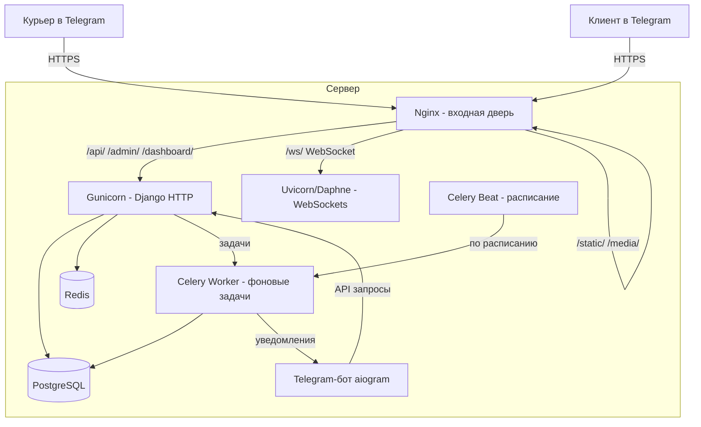

# Подготовка к деплою WERP / Osnova 2.0 — полный чек-лист

> **Статус:** ✅ РЕАЛИЗОВАНО (2026-08-31). Критичные баги исправлены, Celery внедрён, инфраструктура готова.
> **Цель:** Стабильная бесшовная работа в продакшене: Django + PostgreSQL + Redis + Celery + Telegram-бот + Mini App.
>
> **Что сделано:**
> - `wsgi.py` — исправлен модуль настроек (`temp_project.settings` → `WERP_system.settings`)
> - `settings.py` — безопасность: `DEBUG=False` по умолчанию, `SECRET_KEY` обязателен, ngrok только при DEBUG, строгая проверка Telegram-подписи, SSL-настройки
> - Celery + Celery Beat — внедрены (см. Concepts_CeleryRedis.md)
> - `docker-compose.yml` — добавлены `web`, `celery-worker`, `celery-beat`, `nginx`
> - `Dockerfile` и `nginx.conf` — созданы
> - `/health/` — эндпоинт проверки БД и Redis
> - `pytest.ini` — создан, тесты запускаются (99/100 проходят)

---

## 0. Как вообще делается деплой и зачем Nginx

### 0.1 Что такое деплой простыми словами

**Деплой** — это перенос проекта с компьютера разработчика (где он работает через `runserver`) на **сервер**, где он работает постоянно и доступен другим людям (курьерам, клиентам, диспетчеру).

Сейчас всё крутится в одном процессе: `python manage.py runserver` поднимает и Django, и отдаёт статику, и слушает порт 8000. Это удобно для разработки, но **непригодно для продакшена**:

| Проблема `runserver` | Что нужно в проде |
|---|---|
| Один процесс — упал, всё упало | Несколько процессов (workers) |
| Не умеет HTTPS | Nginx + SSL |
| Отдаёт статику медленно (через Python) | Nginx отдаёт файлы напрямую |
| Нет фоновых задач | Celery worker |
| Нет расписания | Celery beat |
| Нет очередей | Redis |

### 0.2 Из каких процессов состоит продакшен

Вся система — это **несколько отдельных процессов**, работающих одновременно на одном сервере:



Каждый процесс — это **отдельная команда** в Docker-контейнере:

```bash
# 1. Веб-сервер (обрабатывает HTTP-запросы)
gunicorn WERP_system.wsgi:application --bind 0.0.0.0:8000

# 2. ASGI-сервер (WebSockets для живого Dashboard)
uvicorn WERP_system.asgi:application --port 8001

# 3. Фоновые задачи
celery -A WERP_system worker

# 4. Расписание
celery -A WERP_system beat

# 5. Telegram-бот
python -m tg_bot
```

### 0.3 Зачем нужен Nginx

**Nginx — это «входная дверь» сервера.** Все запросы из интернета сначала приходят к нему, и он решает, кому их передать.

**Три главные задачи Nginx:**

**1. HTTPS (SSL).** Telegram **требует** HTTPS для Mini App. Nginx терминирует SSL-шифрование: принимает зашифрованный трафик, расшифровывает и передаёт Django по внутренней сети. Django сам SSL не умеет.

**2. Раздача статики.** Файлы Mini App (React-сборки), CSS, картинки — Nginx отдаёт их **напрямую с диска**, без участия Python. Это в десятки раз быстрее. Django вообще не видит эти запросы.

**3. Маршрутизация (reverse proxy).** Nginx смотрит на URL и направляет запрос в нужный процесс:

```nginx
location /static/ {          # статика → файлы с диска
    alias /app/staticfiles/;
}

location /media/ {           # медиа → файлы с диска
    alias /app/media/;
}

location /ws/ {              # WebSocket → ASGI-сервер
    proxy_pass http://127.0.0.1:8001;
    proxy_set_header Upgrade $http_upgrade;
    proxy_set_header Connection "upgrade";
}

location / {                 # всё остальное → Django
    proxy_pass http://127.0.0.1:8000;
}
```

**Почему нельзя без Nginx:**

| Без Nginx | С Nginx |
|---|---|
| Django слушает порт 8000 «голым» | Nginx на 80/443, Django скрыт внутри |
| Нет HTTPS → Telegram не откроет Mini App | HTTPS через Let's Encrypt |
| Статику отдаёт Python (медленно) | Статику отдаёт Nginx (мгновенно) |
| Один процесс на всё | Балансировка между несколькими workers |
| WebSocket-апгрейды не работают | Nginx проксирует `Upgrade` заголовки |

### 0.4 Как выглядит путь запроса

**Пример: курьер нажимает «Подтвердить доставку» в Telegram**

```
1. Telegram → https://werp.uz/api/bot/orders/42/deliver/
2. Nginx принимает запрос (расшифровывает SSL)
3. Nginx видит /api/ → передаёт Gunicorn (порт 8000)
4. Django обрабатывает: сигналы создают транзакцию, списывают склад
5. Django отвечает курьеру: "Доставлено ✅"
6. Django ставит задачу в Redis: "отправь уведомление клиенту"
7. Celery worker забирает задачу, отправляет сообщение клиенту
8. Клиент видит: "Ваш заказ доставлен 🎉"
```

Курьер получил ответ **мгновенно** (шаг 5), а уведомление клиенту ушло **в фоне** (шаги 6-8) — это и есть «бесшовная работа».

### 0.5 Что нужно для деплоя (минимум)

1. **Сервер** — VPS (2-4 ГБ RAM). Хватит для масштаба проекта.
2. **Домен** — `werp.uz` или подобный (для HTTPS и Telegram).
3. **Docker + Docker Compose** на сервере.
4. **`.env` файл** с продакшен-настройками (все флаги безопасности из чек-листа).
5. **Nginx** — конфиг из [`docs/CLAUDE.md`](../../docs/CLAUDE.md) (там уже есть готовый).
6. **Let's Encrypt** — бесплатный SSL-сертификат.

### 0.6 Порядок деплоя (коротко)

```bash
# На сервере:
git clone <репозиторий>
cd WERP_system
cp .env.example .env          # заполнить продакшен-настройки
docker compose up -d --build  # поднять все контейнеры
docker compose exec web python manage.py migrate
docker compose exec web python manage.py collectstatic --noinput
```

После этого система работает: Nginx на 80/443, Django внутри, Celery в фоне, бот слушает Telegram.

---

## 1. Критичные баги, которые нужно исправить ДО деплоя

### 1.1 ❌ `wsgi.py` указывает на несуществующий модуль настроек

[`WERP_system/wsgi.py`](../../WERP_system/wsgi.py:14) содержит:

```python
os.environ.setdefault('DJANGO_SETTINGS_MODULE', 'temp_project.settings')
```

Должно быть:

```python
os.environ.setdefault('DJANGO_SETTINGS_MODULE', 'WERP_system.settings')
```

**Почему критично:** Gunicorn при деплое читает `wsgi.py`. С неверным модулем настроек сервер упадёт при старте. Сейчас проект работает только потому, что `manage.py` и `asgi.py` указывают правильный модуль.

### 1.2 ⚠️ `DEBUG=True` по умолчанию

[`WERP_system/settings.py`](../../WERP_system/settings.py:12):

```python
DEBUG = os.getenv('DEBUG', 'True') == 'True'
```

В продакшене `DEBUG` **обязан** быть `False`. Иначе:
- показываются трейсбеки с путями и секретами;
- статика отдаётся Django (медленно);
- `ALLOWED_HOSTS` не защищает.

### 1.3 ⚠️ `SECRET_KEY` с fallback

[`WERP_system/settings.py`](../../WERP_system/settings.py:11):

```python
SECRET_KEY = os.getenv('DJANGO_SECRET_KEY', 'fallback-if-not-found')
```

В продакшене fallback-значение недопустимо — нужно жёстко требовать переменную из окружения.

### 1.4 ⚠️ `ALLOWED_HOSTS` включает ngrok

[`WERP_system/settings.py`](../../WERP_system/settings.py:14):

```python
ALLOWED_HOSTS = os.getenv('ALLOWED_HOSTS', '127.0.0.1,localhost,.ngrok-free.dev').split(',')
```

Для продакшена — только реальный домен. ngrok-домены убрать.

### 1.5 ⚠️ CORS разрешает все ngrok-домены

[`WERP_system/settings.py`](../../WERP_system/settings.py:144):

```python
CORS_ALLOWED_ORIGIN_REGEXES = [
    r"^https://.*\.ngrok-free\.dev$",
    r"^https://.*\.ngrok\.io$",
]
```

В продакшене — только реальный домен Mini App.

### 1.6 ⚠️ Безопасность Telegram-подписи

[`WERP_system/settings.py`](../../WERP_system/settings.py:170):

```python
BOT_BRIDGE_REQUIRE_TG_HEADER = os.getenv('BOT_BRIDGE_REQUIRE_TG_HEADER', 'False') == 'True'
BOT_BRIDGE_VERIFY_INIT_DATA = os.getenv('BOT_BRIDGE_VERIFY_INIT_DATA', 'False') == 'True'
```

В продакшене оба флага **обязательно** `True`. Иначе любой может подделать `X-Telegram-ID` и получить доступ к данным.

---

## 2. Инфраструктура (docker-compose)

### 2.1 Текущее состояние

[`docker-compose.yml`](../../docker-compose.yml) содержит только `db` (PostgreSQL) и `redis`. Нет:
- веб-сервера (Gunicorn/Uvicorn);
- Celery worker;
- Celery beat;
- Nginx.

### 2.2 Целевое состояние

```yaml
services:
  db:            # PostgreSQL 17 (уже есть)
  redis:         # Redis 7 (уже есть)

  web:           # Django + Gunicorn (WSGI) + Uvicorn (ASGI/WebSocket)
    build: .
    command: gunicorn WERP_system.wsgi:application --bind 0.0.0.0:8000 --workers 3
    depends_on: [db, redis]

  celery-worker:
    build: .
    command: celery -A WERP_system worker --loglevel=info
    depends_on: [db, redis]

  celery-beat:
    build: .
    command: celery -A WERP_system beat --loglevel=info
    depends_on: [db, redis]

  nginx:
    image: nginx:alpine
    ports: ["80:80", "443:443"]
    volumes:
      - ./nginx.conf:/etc/nginx/conf.d/default.conf
      - ./staticfiles:/staticfiles
      - ./media:/media
    depends_on: [web]
```

### 2.3 WebSockets в продакшене

[`WERP_system/asgi.py`](../../WERP_system/asgi.py) уже настроен на Channels. Но Gunicorn **не умеет** WebSockets. Нужно:

- **Вариант A (рекомендуется):** Uvicorn с `--workers` для ASGI-приложения, Nginx проксирует WebSocket-апгрейды.
- **Вариант B:** Daphne (ASGI-сервер Channels).

Nginx-конфиг для WebSocket (уже описан в [`docs/CLAUDE.md`](../../docs/CLAUDE.md)):

```nginx
location / {
    proxy_pass http://127.0.0.1:8000;
    proxy_http_version 1.1;
    proxy_set_header Upgrade $http_upgrade;
    proxy_set_header Connection "upgrade";
}
```

---

## 3. Celery (см. отдельный документ)

Полный план — в [`docs/Concepts/Concepts_CeleryRedis.md`](Concepts_CeleryRedis.md).

Кратко:
- добавить `celery`, `django-celery-beat` в `requirements.txt`;
- создать `WERP_system/celery.py`;
- настроить брокер `redis://.../2`;
- перенести уведомления и периодические задачи;
- **сигналы денег и склада остаются синхронными**.

---

## 4. Telegram-бот

### 4.1 Webhook вместо Polling

[`tg_bot/config.py`](../../tg_bot/config.py:20):

```python
USE_WEBHOOK = os.getenv('USE_WEBHOOK', 'false').lower() == 'true'
```

В продакшене — `USE_WEBHOOK=true`. Polling нестабилен при перезапусках и не масштабируется.

### 4.2 RedisStorage для FSM

Сейчас FSM-состояния aiogram хранятся в памяти. При перезапуске бота состояния теряются. Перевести на `RedisStorage` (в `requirements_bot.txt` уже есть `redis==5.0.7`).

### 4.3 Бот и Django — раздельные процессы

Бот (`tg_bot/`) и Django — разные приложения. В продакшене:
- Django + Celery — в Docker;
- бот — отдельный процесс (или отдельный контейнер), с `DJANGO_API_URL` указывающим на реальный домен.

---

## 5. База данных

### 5.1 Резервное копирование

Обязательно настроить автоматический бэкап PostgreSQL (например, `pg_dump` по cron или через `wal-g`/`pgbackrest`).

### 5.2 Индексы

Проверить индексы для частых выборок (описано в [`docs/CLAUDE P6+.md`](../CLAUDE%20P6+.md)):
- `Order`: `status + delivered_at`, `created_at`, `trip + status`;
- `CourierShift`: `status + date`, `courier + date`;
- `Finance`: `date`;
- `FinancialTransactions`: `date + type`.

### 5.3 Миграции

Перед деплоем: `python manage.py makemigrations --check` (убедиться, что нет неприменённых миграций) и `python manage.py migrate`.

---

## 6. Безопасность

| Мера | Статус |
|---|---|
| `DEBUG=False` | ❌ сейчас `True` по умолчанию |
| `SECRET_KEY` из окружения, без fallback | ❌ сейчас есть fallback |
| `ALLOWED_HOSTS` = только домен | ❌ сейчас включает ngrok |
| CORS = только домен Mini App | ❌ сейчас разрешает ngrok |
| `BOT_BRIDGE_REQUIRE_TG_HEADER=True` | ❌ сейчас `False` |
| `BOT_BRIDGE_VERIFY_INIT_DATA=True` | ❌ сейчас `False` |
| HTTPS (Let's Encrypt) | ❌ не настроен |
| `SECURE_SSL_REDIRECT`, `SESSION_COOKIE_SECURE`, `CSRF_COOKIE_SECURE` | ❌ не настроены |
| Ограничение попыток входа в Admin | ❌ не настроено |
| Бэкапы БД | ❌ не настроены |

---

## 7. Мониторинг и логирование

### 7.1 Логирование

Настроить:
- логи Django в файл/`stdout` (для Docker);
- логи Celery worker;
- логи бота.

### 7.2 Sentry (рекомендуется)

Sentry ловит исключения в продакшене и присылает алерты. Для Django + Celery + бота.

### 7.3 Health-check

Добавить эндпоинт `/health/`, который проверяет:
- подключение к БД;
- подключение к Redis;
- доступность Celery worker.

Nginx/мониторинг (UptimeRobot, Better Stack) будет дёргать этот эндпоинт.

---

## 8. Статика и медиа

### 8.1 `collectstatic`

Перед деплоем: `python manage.py collectstatic --noinput`. Nginx раздаёт `/staticfiles/`.

### 8.2 Mini App

Собранные фронтенды уже лежат в [`static/miniapp/`](../../static/miniapp/). После пересборки — снова `collectstatic`.

### 8.3 Медиа

`/media/` (контракты, фото товаров) — Nginx раздаёт напрямую. Убедиться, что папка доступна на запись.

---

## 9. Порядок деплоя (пошагово)

1. Исправить `wsgi.py` (модуль настроек).
2. Настроить `.env` для продакшена (все флаги безопасности).
3. Добавить Celery (см. Concepts_CeleryRedis.md).
4. Обновить `docker-compose.yml` (web, worker, beat, nginx).
5. Настроить Nginx + SSL (Let's Encrypt).
6. `collectstatic` + `migrate`.
7. Настроить бэкапы БД.
8. Настроить Sentry + health-check.
9. Перевести бота на webhook + RedisStorage.
10. Проверить WebSockets (Dashboard обновляется без перезагрузки).
11. Тест: полный цикл курьера (смена → рейс → доставка → отчёт в Telegram).

---

## 10. Что НЕ нужно делать на первом этапе

- **Не** добавлять RabbitMQ — Redis-брокера достаточно для масштаба проекта.
- **Не** строить Kubernetes — один сервер + Docker Compose достаточно.
- **Не** делать сложный CI/CD — достаточно простого деплой-скрипта (git pull + docker compose up -d --build).
- **Не** добавлять отдельный сервер для фронтенда — статика раздаётся через Nginx.

---

## 11. Как безопасно редактировать задеплоенный проект

### 11.1 Главный принцип: никогда не редактировать файлы прямо на сервере

Сервер — это «витрина». Код готовится локально (в мастерской), а на сервер попадает только через `git pull`.

```
Локально (твой компьютер)          Сервер (продакшен)
─────────────────────────          ─────────────────────
1. git checkout -b feature/fix     (не трогаем!)
2. Пишешь код, тестируешь
3. git add + git commit
4. git push origin feature/fix
5. Создаёшь Pull Request
6. Проверяешь, мёржишь в master
7. git pull на сервере  ←─── только так код попадает на сервер
8. docker compose up -d --build
```

**Правила:**
- На сервере — только `git pull` (обновление из репозитория).
- Никогда не `vim` файлы на сервере.
- Каждое изменение — отдельная ветка + коммит.
- Перед деплоем — тесты (`pytest`).

### 11.2 Почему это безопасно

| Риск | Как защищаемся |
|---|---|
| Сломать код | Тесты перед деплоем (`pytest`) |
| Потерять данные | Бэкап БД перед миграциями |
| Сломать БД | Миграции отдельно от кода |
| Упасть в проде | Откат: `git revert` + перезапуск |
| Случайно изменить | На сервере нет прав на запись в код |

### 11.3 Безопасный деплой изменений (пошагово)

```bash
# 1. Бэкап БД (обязательно перед миграциями!)
docker compose exec db pg_dump -U $DB_USER $DB_NAME > backup_$(date +%F).sql

# 2. Обновить код
git pull origin master

# 3. Применить миграции (сначала!)
docker compose exec web python manage.py migrate

# 4. Собрать статику
docker compose exec web python manage.py collectstatic --noinput

# 5. Перезапустить контейнеры
docker compose up -d --build
```

**Порядок важен:** сначала миграции, потом код. Если код уже новый, а БД старая — падает.

### 11.4 Что делать, если что-то сломалось

```bash
# Быстрый откат к предыдущей версии
git revert HEAD
docker compose up -d --build

# Или восстановить БД из бэкапа
docker compose exec -T db psql -U $DB_USER $DB_NAME < backup_2026-08-31.sql
```

### 11.5 Дополнительные меры безопасности

| Мера | Зачем |
|---|---|
| **Ветка `master` защищена** (GitHub/GitLab) | Никто не пушит напрямую, только через PR |
| **Тесты в CI** (GitHub Actions) | Автоматически проверяют код перед деплоем |
| **Staging-сервер** (копия прода) | Сначала проверить изменения на копии |
| **Бэкапы по расписанию** | Автоматический `pg_dump` каждый день |
| **`DEBUG=False`** | Ошибки не показывают пути и секреты |
| **Sentry** | Ловит ошибки в проде и присылает алерт |

### 11.6 Простой вариант для начала (без CI/CD)

Минимальный безопасный цикл для проекта вашего масштаба:

```
1. Локально: git commit + git push
2. На сервере: git pull
3. На сервере: docker compose up -d --build
4. Проверить /health/
```

CI/CD (GitHub Actions) можно добавить позже, когда появится потребность.